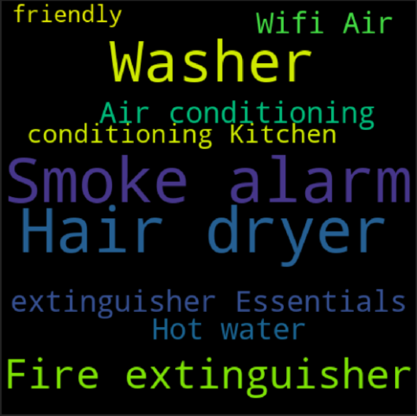

# Final Project Purwadhika 2020
# Tokyo Airbnb Project - Price Prediction and Space Recommendation
### by Giovaldi R. ( JCDS Purwadhika Bandung 0306 ) 
http://insideairbnb.com/

## LANGUAGES

  
  
  
  
 

Airbnb telah mengembangkan sayapnya di berbagai negara termasuk di Jepang tepatnya Tokyo pada tahun 2010. Berdasarkan perkembangan waktu, ada beberapa riset yang menyatakan bahwa penerapan Minpaku Law oleh pemerintah di tahun 2018 menjadi titik terbawah dalam perkembangan Airbnb Tokyo. Seiring berjalannya waktu, Airbnb Tokyo mulai bangkit dan di tahun 2019 diumumkan sebagai Sponsor dari perhelatan Olimpiade Internasional yaitu 2020 Olympics. Tentu hal ini akan memberikan dampak positif bagi Pengusaha Airbnb, sehingga diharuskan untuk mengetahui setiap celah untuk mendapatkan profit. Penempatan lokasi Stadium terhadap Airbnb pun dirasa sangat berdampak di saat acara dengan estimasi 600.000 pengunjung asing ini berlangsung. Diantara hal tersebut, satu yang sangat krusial untuk memperoleh profit adalah HARGA. Disini saya akan mencoba memprediksi harga berdasarkan pendekatan Supervised Learning : Regression untuk membantu Pengusaha Airbnb yang baru akan berkecimpung ke dalam bisnis Airbnb dan juga memberikan Recommendation System berdasarkan pendekatan terhadap rating dan space untuk membantu Pengusaha Airbnb yang telah masuk di dalam bisnis ini agar dapat memperbaiki cara bisnisnya. 

### Problems

- Pengusaha Airbnb tidak mengetahui peraturan ketat terkait persyaratan Minpaku Law yang dapat menyebabkan pembatalan operasi.
- Pengusaha Airbnb tidak mengetahui top area penjualan Airbnb yang berlokasi dekat dengan lokasi venue 2020 Olympics yang dapat memaksimalkan keuntungan.
- Pengusaha Airbnb tidak mengetahui harga yang tepat yang dapat digunakan pada saat menyewakan Airbnb

### Goals

- Mendapatkan Analisis terkait Airbnb yang legal berdasarkan aturan "Minpaku Law" mengenai maksimum hari dapat beroperasinya sebuah Airbnb pertahun (pandas)
- Mendapatkan Analisis terkait perkembangan untuk Airbnb yang berlokasi dekat dengan venue yang akan dipakai pada 2020 Olympics (pandas,folium,seaborn,matplotlib,wordcloud)
- Mendapatkan prediksi harga Airbnb dengan menggunakan Supervised Learning Regression sebagai kunci utama dalam menyewakan Airbnb serta mendapatkan profit.
- Mendapatkan rekomendasi space Airbnb dengan Recommendation System Content-Based untuk membantu Pengusaha Airbnb yang telah berkecimpung di dunia ini agar lebih maksimal dalam memperoleh spesifikasi terbaik berdasarkan area top 5 terprofit.

### Ipynb

- Handling Missing Values, Duplicated
- Exploratory Data Analysis (EDA) Visualization with pandas, seaborn,matplotlib,folium and wordcloud
- Feature Engineering with TrainTestSplit, PowerTransformer, RobustScaler, Adding Feature, Extracting and PolynomialFeature
- Machine Learning Model (Linear Regression, Random Forest, KNN, XGBoost, GradientBoosting) with Hyperparameter Tuning
- Evaluation Metrics (R2,MAE,MSE,RMSE)
- Recommendation System (Content-Based)
- Conclusion

### Exploratory Data Analysis
- https://www.geeksforgeeks.org/univariate-bivariate-and-multivariate-data-and-its-analysis/ Univariate, Bivariate, Multivariate
- https://python-graph-gallery.com buat seaborn,matplotlib, wordcloud
- https://python-visualization.github.io/folium/ buat folium
- https://pandas.pydata.org/pandas-docs/stable/user_guide/visualization.html buat pandas
- https://pandas.pydata.org/pandas-docs/stable/user_guide/reshaping.html buat pandas pivot table

#### Neighbourhood

#### Numerical Univariate Visualization

#### Categorical Univariate Visualization

#### Amenities

### Mendapatkan analisis data Airbnb yang legal berdasarkan aturan "Minpaku Law" mengenai maksimum hari dapat beroperasinya sebuah Airbnb pertahun.
- Terdapat 7526 airbnb yang legal atau mematuhi peraturan terkait Minpaku Law tentang 180 hari beroperasinya sebuah Airbnb. Berdasarkan pemetaan data yang legal banyak terlihat di lokasi dekat dengan Pusat kota.
- Dari sebelumnya 55 neighbourhood, setelah dilakukan penerapan Minpaku Law tersisa 51 area yang mana tidak ada area adachi,koganei shi,ogasawara,akiruno shi disini. Setelah ditelaah melalui riset, area tersebut memang termasuk area tersedikit untuk jumlah Airbnb di Tokyo. Dari penelusuran wikipedia ditemukan ke empat area ini merupakan area yang jauh dari pusat kota 40 hingga 50 km jaraknya. Dan juga akses untuk kesana sangatlah sedikit yaitu hanya kereta dengan sedikit line(jalur/jurusan) dan tol saja. 
- Untuk type ruangan sendiri, area Shinjuku di airbnb legal ini masih menjadi yang pertama untuk Entire home/Apt, dan Taito Untuk Private Room,Shared Room dan Hotel room. Sisanya tidak terlalu banyak perubahan hanya nilainya saja yang berkurang. Untuk property type sendiri juga sama, apartment masih yang nomor 1, yang mana banyak bertipe ruangan Entire home/apt dengan jumlah 3964 dan terbanyak di Shinjuku dengan total 1008,untuk private room ada kesamaan untuk property tipe apartment(450,Shinjuku 66) dan house(450,Shinjuku 39). Lalu untuk shared dan hotel room paling banyak di property hostel. Terdapat 146 shared room dan terbanyak di Taito dengan 45. Untuk hotel room berjumlah 172 dan terbanyak di Chuo Ku. Chuo akan saya bahas disini setelah dua yang lain sudah sering dibahas sebelumnya. Menurut sumber Area Chuo ini merupakan area yang terkenal dengan perkantoran perusahaan-perusahaan berkelas Internasional. Salah satunya IBM,McKinsey & Company, Astellas Pharma, a global pharmaceutical company, KOSÉ perusahaan kosmetik internasional. Dan juga perusahaan Jepang yang sudah mendunia seperti Kao, Ajinomoto. Hal ini mungkin sangat sebanding dengan banyaknya jumlah hotel disana untuk menampung tamu-tamu asing di area tersebut. 
- Perkembangan harga airbnb legal ini sangat besar untuk Entire home/Apt. Dimana jenis ruangan lain banyak yang turun di 2018 ataupun stagnan, Entire home/Apt malah cenderung naik meskipun tidak banyak diangka 18000 yen ke 20000 yen. Lalu ada hal baru lagi yang kita dapatkan disini bahwa, Hotel Room berhenti tahun 2019. Setelah ditelaah ini terjadi karena banyak hotel yang memiliki bintang kecil (3 bintang) memasang harga yang cukup mahal. Terlebih lagi disebutkan, kualitas dan amenities nya pun kurang apabila dibandingkan dengan Airbnb. Lalu Airbnb biasa memiliki experience lain yang ditawarkan Host, sedangkan menginap di hotel akan memiliki experience yang sama dimana pun di dunia. Jadi, meskipun sempat naik di 2016 akhirnya hotel room berusaha menyamakan price nya di tahun 2018 dan karena tidak berhasil untuk dapat untung akhirnya menyelesaikan kerja sama nya dengan airbnb di 2019 tepatnya awal 2019.

### Mendapatkan analisis tentang perkembangan untuk Airbnb yang berlokasi dekat dengan venue yang akan dipakai pada 2020 Olympics
- Saya membuat kolom baru bernama posisi, berdasarkan kedekatan posisi neighbourhood terhadap lokasi Stadium. Dibagi menjadi tiga agar lebih mudah mengerti, yaitu dekat, menengah dan jauh. Jumlah yang dekat lebih banyak sedikit dibandingkan yang lain. Berdasarkan penelusuran, dapat disimpulkan bahwa Airbnb yang berlokasi dekat dengan Stadium memiliki kenaikkan jumlah yang sangat pesat pertahunnya. Untuk 3 tahun terakhir 2017,2018,2019 jumlahnya terus naik 857,1548,1800. Dan untuk 2020 yang mana datanya cuma sampai bulan ke 4 sudah mencapai 510. atau 1/3 dari tahun 2019. 
- Untuk rata-rata harganya pun untuk yang berlokasi dekat naik terus melonjak setiap tahunnya akan tetapi dua tahun terakhir yaitu 2019-2020 awal naiknnya paling terlihat yaitu 10% . Apabila di rupiahkan yaitu sebesar 477680. 
- Untuk akomodasi sendiri ditahun 2020 untuk jarak yang dekat naik menjadi 11% dari tahun 2019/ tahun pengumuman Tokyo menjadi Host 2020 Olympics dan 48% dari tahun 2018. Kenaikkan nya 2 hampir kali lipat. 
- Untuk bedrooms dari tahun 2019 untuk satu kamar, naik 7-8%. Untuk area sendiri rata-rata harga termahal sekarang adalah Shibuya dengan rata-rata 26317/ 3juta rupiah. Siapa yang tidak tahu Shibuya? Shibuya Crossing adalah tempat penyebrangan terpadat di dunia, dijuluki sebagai area tak pernah tidur 24 jam non stop. Untuk data top 5 Shibuya Ku', 'Shinjuku Ku', 'Toshima Ku', 'Taito Ku', 'Sumida Ku juga tidak kalah menarik. Dimana Shibuya merupakan area dengan rata-rata harga termahal.

### Dashboard Flask

### Evaluation Metrics

| XGBoost |  |
| --- | --- |
| R square | 0.78 |
| MAE | 0.2 |
| MSE | 0.2 |
| RMSE | 0.4 |

### Recommendation System

### Conclusion

Dari peta persebaran dapat dilihat bahwa persebaran angka Airbnb memang terpusat di tengah kota yang cenderung dekat dengan Stadium-Stadium yang akan digunakan di 2020 Olympics . Berdasarkan angka kasat mata, Shinjuku merupakan area yang paling banyak memiliki Airbnb yang disewakan. Setelah sebelumnya melihat angka-angkanya berdasarkan cluster, saya juga memetakan lagi dengan Heatmap dan terlihat Shinjuku memiliki density Airbnb terbesar. Setelah ditelaah, Shinjuku memang dijuluki salah satu kota teramai di Tokyo. Terlebih lagi Stasiun di Shinjuku ini atau Stasiun Shinjuku merupakan stasiun tersibuk di dunia sejak tahun 2007. untuk setiap harinya dengan berbagai line baik bawah tanah , maupun biasa terdapat 3.64 juta orang perhari. Berdasarkan data diatas, dapat dilihat host_is_superhost f nya kok lebih besar? jelek semua dong? tentu tidak, jd superhost ini diberikan oleh airbnb kepada host yang mana memberikan contoh teladan untuk host yang lain dan memberikan experience yang lebih baik kepada guest nya. Apa sisanya berarti jelek? tentu engga, jd kayak pemberian mvp atau murid teladan. seluruh host ini bisa dibilang sama-sama berjuang disini tp hanya beberapa aja yg dipilih. Dan jg badge superhost ini tidak tetap jg krn akan diperbaharui terus selama 4 tahun sekali menurut situs resmi airbnb. Lalu belum dilakukan bivariate dengan Price sehingga tidak dapat disimpulkan hanya dengan melihat jumlahnya saja. Untuk host_identity_verified hal ini juga terasa janggal karena banyak yg ga terverifikasi? apakah menandakan banyak yang ilegal? jd menurut situs airbnb nya. ada yang disebut host_verifications yang berbentuk list tentang bagaimana cara host memverifikasi akunnya. ada by email, government id, facebook dll. Lalu setelah disetujui, tentu mereka akan dpt balasan dari airbnb untuk mengklik verifikasi, disinilah banyak yang tidak memperdulikan hal tsb. Akan lebih jelas kegunaannya nanti setelah dilakukan uji bivariate. Untuk kolom Room Type Entire home/apt merupakan yang paling banyak, hal ini terjadi karena tipe ini dinilai sangat cocok untuk orang jepang dan turis yang menginap yang membutuhkan ketenangan. Dimana ruangan dengan tipe ini memiliki seluruh tempat untuk diri mereka sendiri tanpa harus share dengan orang lain atau pemilik rumah. Yang biasanya mencakup kamar tidur, kamar mandi, dan dapur. Untuk Property Type, Property jenis apartment paling banyak digunakan untuk pengusaha Airbnb karena memiliki beberapa kemudahan untuk yang menginap dan turis yang ingin tinggal dalam jangka waktu pendek. Cancelation policies, pembatalan yang selain tiga teratas terasa sangat kontras, sehingga nantinya akan dilihat lebih dalam. Dari segi verifikasi terhadap host, ada beberapa top yang digunakan host untuk memverifikasi akun mereka. Ada istilah yang baru disini yaitu "Jumio". jumio adalah identity verifications berbasis AI yang mana dipercaya dapat mengurangi kecurangan, kebohongan identitas dll. Dapat disimpulkan bahwa untuk menjadi host Airbnb, harus memiliki persyaratan-persyaratan tersebut. Tentu alasannya adalah untuk keamanan dan agar tidak terjadi kebohongan-kebohongan terkait identitas yang dapat merugikan guest nantinya. Untuk data berdasarkan tipe ruangan sendiri dapat dilihat tipe Entire Home/Apt paling banyak masih terletak di Shinjuku, Untuk Private Room,Hotel, dan Shared Room keseluruhan banyak di Taito Ku. Setelah ditelaah ternyata Taito ini merupakan area yang terkenal akan wisata budaya nya salah satunya Sensoji Temple di asakusa. Dari segi harga tersendiri, bagi Pengusaha Airbnb, sebaiknya melihat kedekatan lokasi Venue sebagai faktor yang menjanjikan, setelah itu dari hasil Recommender System terdapat beberapa Airbnb yang memiliki kriteria space yang berbeda yang dapat dijadikan acuan. Setelah seluruh kebutuhan tempat, spesifikasi telah terpenuhi, Ada beberapa perlengkapan yang perlu ada di Airbnb anda untuk di Tokyo ini yaitu Heater, Washer, Wifi, Smoke Alarm dll. 

## Connect with me

[][linkedin]
[][instagram]

[instagram]: https://www.instagram.com/giovaldirch
[linkedin]: https://www.linkedin.com/in/giovaldi-r-00263411a/

 
