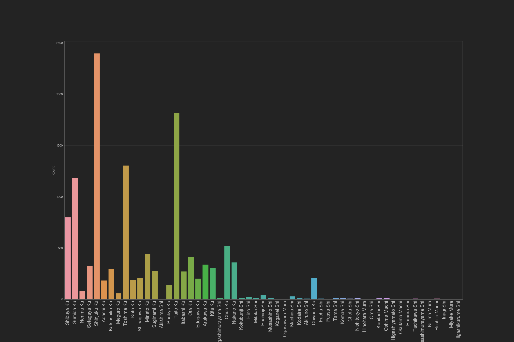
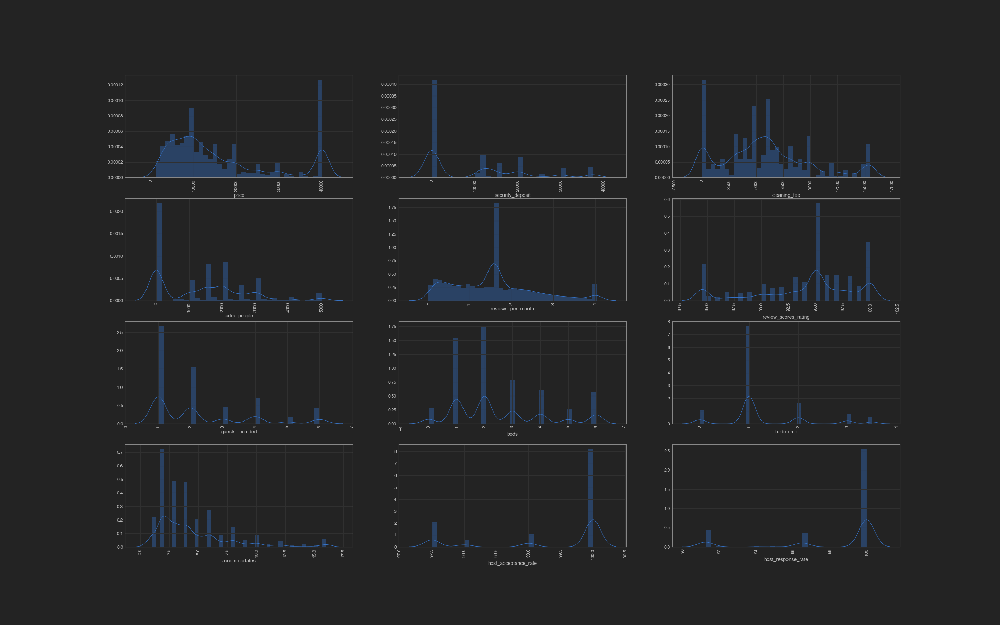
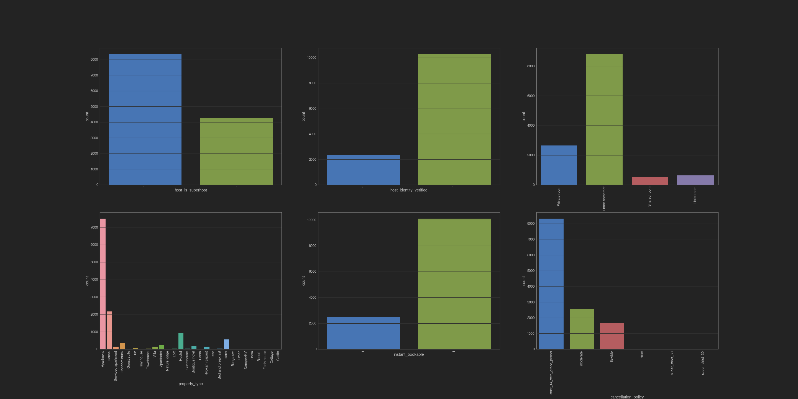
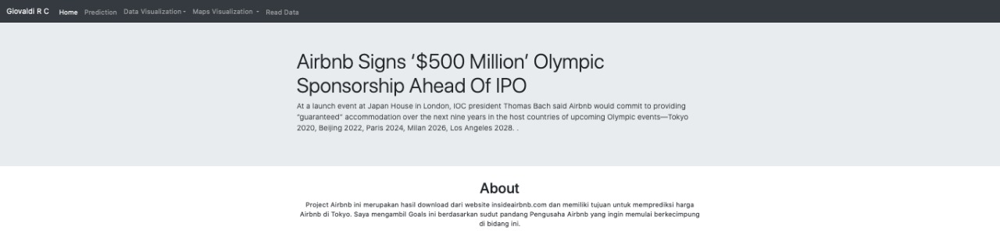

# Final Project Purwadhika 2020
## Tokyo Airbnb Project - Price Prediction and Space Recommendation
### by Giovaldi R. ( JCDS Purwadhika 0306 ) 
- dataset di download langsung dari website airbnb di http://insideairbnb.com/

#### Programming Languages

  
  
  
  

 
 

Airbnb telah mengembangkan sayapnya di berbagai negara termasuk di Jepang tepatnya Tokyo pada tahun 2010. Berdasarkan perkembangan waktu, ada beberapa riset yang menyatakan bahwa penerapan Minpaku Law oleh pemerintah di tahun 2018 menjadi titik terbawah dalam perkembangan Airbnb Tokyo. Seiring berjalannya waktu, Airbnb Tokyo mulai bangkit dan di tahun 2019 diumumkan sebagai Sponsor dari perhelatan Olimpiade Internasional yaitu 2020 Olympics. Tentu hal ini akan memberikan dampak positif bagi Pengusaha Airbnb, sehingga diharuskan untuk mengetahui setiap celah untuk mendapatkan profit. Penempatan lokasi Stadium terhadap Airbnb pun dirasa sangat berdampak di saat acara dengan estimasi 600.000 pengunjung asing ini berlangsung. Diantara hal tersebut, satu yang sangat krusial untuk memperoleh profit adalah HARGA. Disini saya akan mencoba memprediksi harga berdasarkan pendekatan Supervised Learning : Regression untuk membantu Pengusaha Airbnb yang baru akan berkecimpung ke dalam bisnis Airbnb dan juga memberikan Recommendation System berdasarkan pendekatan terhadap rating dan space untuk membantu Pengusaha Airbnb yang telah masuk di dalam bisnis ini (cenderung kurang profit) agar dapat memperbaiki cara bisnisnya. 

## PROBLEMS

- Pengusaha Airbnb tidak mengetahui peraturan ketat terkait persyaratan Minpaku Law yang dapat menyebabkan pembatalan operasi.
- Pengusaha Airbnb tidak mengetahui top area penjualan Airbnb yang berlokasi dekat dengan lokasi venue 2020 Olympics yang dapat memaksimalkan keuntungan.
- Pengusaha Airbnb tidak mengetahui harga yang tepat yang dapat digunakan pada saat menyewakan Airbnb

## GOALS

- Mendapatkan Analisis terkait Airbnb yang legal berdasarkan aturan "Minpaku Law" mengenai maksimum hari dapat beroperasinya sebuah Airbnb pertahun (pandas)
- Mendapatkan Analisis terkait perkembangan untuk Airbnb yang berlokasi dekat dengan venue yang akan dipakai pada 2020 Olympics (pandas,folium,seaborn,matplotlib,wordcloud)
- Mendapatkan prediksi harga Airbnb dengan menggunakan Supervised Learning Regression sebagai kunci utama dalam menyewakan Airbnb serta mendapatkan profit.
- Mendapatkan rekomendasi space Airbnb dengan Recommendation System Content-Based untuk membantu Pengusaha Airbnb yang telah berkecimpung di dunia ini agar lebih maksimal dalam memperoleh spesifikasi terbaik berdasarkan area top 5 terprofit.

### STEPS

- Handling Missing Values, Duplicated [Jupyter](https://github.com/giovaldir/FINAL-PROJECT-TOKYO-AIRBNB/blob/master/1.FINAL%20PROJECT%20-%20Handling%20Missing%2CDuplicated%20Airbnb.ipynb)
- Exploratory Data Analysis (EDA) Visualization with pandas, seaborn,matplotlib,folium and wordcloud [Jupyter](https://github.com/giovaldir/FINAL-PROJECT-TOKYO-AIRBNB/blob/master/2.FINAL%20PROJECT%20-%20Exploratory%20Data%20Analysis%20Airbnb-2.ipynb)
- Feature Selection with Theils U, Heatmap [Jupyter](https://github.com/giovaldir/FINAL-PROJECT-TOKYO-AIRBNB/blob/master/2.FINAL%20PROJECT%20-%20Exploratory%20Data%20Analysis%20Airbnb-2.ipynb)
- Feature Engineering with Handling Outliers, Transformer, Scaling, Adding Feature, Extracting, Spliting [Jupyter](https://github.com/giovaldir/FINAL-PROJECT-TOKYO-AIRBNB/blob/master/6.FINAL%20PROJECT%20-%20Supervised%20Machine%20Learning%20Airbnb%20(Yeo%20Johnson)-2.ipynb)
- Machine Learning Model (Linear Regression, Random Forest, KNN, XGBoost, GradientBoosting) with Hyperparameter Tuning (GridSearch) [Jupyter](https://github.com/giovaldir/FINAL-PROJECT-TOKYO-AIRBNB/blob/master/6.FINAL%20PROJECT%20-%20Supervised%20Machine%20Learning%20Airbnb%20(Yeo%20Johnson)-2.ipynb)
- Evaluation Metrics (R2,MAE,MSE,RMSE) [Jupyter](https://github.com/giovaldir/FINAL-PROJECT-TOKYO-AIRBNB/blob/master/6.FINAL%20PROJECT%20-%20Supervised%20Machine%20Learning%20Airbnb%20(Yeo%20Johnson)-2.ipynb)
- Recommendation System (Content-Based) [Jupyter](https://github.com/giovaldir/FINAL-PROJECT-TOKYO-AIRBNB/blob/master/8.FINAL%20PROJECT%20RECOMMENDATION%20SYSTEM%20CONTENT%20BASED-2.ipynb)
- Conclusion

### EXPLORATORY DATA ANALYSIS (general)
- proses analisis untuk mendapatkan insight dari data dengan metode pendekatan terhadap grafis dan tabel untuk memaksimalkan wawasan dan menguji hipotesis

[FULL EDA](https://github.com/giovaldir/FINAL-PROJECT-TOKYO-AIRBNB/blob/master/2.FINAL%20PROJECT%20-%20Exploratory%20Data%20Analysis%20Airbnb-2.ipynb)

#### Neighbourhood

#### Numerical Univariate Visualization

#### Categorical Univariate Visualization

#### Amenities

### Mendapatkan analisis data Airbnb yang legal berdasarkan aturan "Minpaku Law" mengenai maksimum hari dapat beroperasinya sebuah Airbnb pertahun.
- Terdapat 7526 airbnb yang legal atau mematuhi peraturan terkait Minpaku Law tentang 180 hari beroperasinya sebuah Airbnb. Berdasarkan pemetaan data yang legal banyak terlihat di lokasi dekat dengan Pusat kota.
- Dari sebelumnya 55 neighbourhood, setelah dilakukan penerapan Minpaku Law tersisa 51 area yang mana tidak ada area adachi,koganei shi,ogasawara,akiruno shi disini. Setelah ditelaah melalui riset, area tersebut memang termasuk area tersedikit untuk jumlah Airbnb di Tokyo. Dari penelusuran wikipedia ditemukan ke empat area ini merupakan area yang jauh dari pusat kota 40 hingga 50 km jaraknya. Dan juga akses untuk kesana sangatlah sedikit yaitu hanya kereta dengan sedikit line(jalur/jurusan) dan tol saja. 
- Untuk type ruangan sendiri, area Shinjuku di airbnb legal ini masih menjadi yang pertama untuk Entire home/Apt, dan Taito Untuk Private Room,Shared Room dan Hotel room. Sisanya tidak terlalu banyak perubahan hanya nilainya saja yang berkurang. Untuk property type sendiri juga sama, apartment masih yang nomor 1, yang mana banyak bertipe ruangan Entire home/apt dengan jumlah 3964 dan terbanyak di Shinjuku dengan total 1008,untuk private room ada kesamaan untuk property tipe apartment(450,Shinjuku 66) dan house(450,Shinjuku 39). Lalu untuk shared dan hotel room paling banyak di property hostel. Terdapat 146 shared room dan terbanyak di Taito dengan 45. Untuk hotel room berjumlah 172 dan terbanyak di Chuo Ku. Chuo akan saya bahas disini setelah dua yang lain sudah sering dibahas sebelumnya. Menurut sumber Area Chuo ini merupakan area yang terkenal dengan perkantoran perusahaan-perusahaan berkelas Internasional. Salah satunya IBM,McKinsey & Company, Astellas Pharma, a global pharmaceutical company, KOSÉ perusahaan kosmetik internasional. Dan juga perusahaan Jepang yang sudah mendunia seperti Kao, Ajinomoto. Hal ini mungkin sangat sebanding dengan banyaknya jumlah hotel disana untuk menampung tamu-tamu asing di area tersebut. 
- Perkembangan harga airbnb legal ini sangat besar untuk Entire home/Apt. Dimana jenis ruangan lain banyak yang turun di 2018 ataupun stagnan, Entire home/Apt malah cenderung naik meskipun tidak banyak diangka 18000 yen ke 20000 yen. Lalu ada hal baru lagi yang kita dapatkan disini bahwa, Hotel Room berhenti tahun 2019. Setelah ditelaah ini terjadi karena banyak hotel yang memiliki bintang kecil (3 bintang) memasang harga yang cukup mahal. Terlebih lagi disebutkan, kualitas dan amenities nya pun kurang apabila dibandingkan dengan Airbnb. Lalu Airbnb biasa memiliki experience lain yang ditawarkan Host, sedangkan menginap di hotel akan memiliki experience yang sama dimana pun di dunia. Jadi, meskipun sempat naik di 2016 akhirnya hotel room berusaha menyamakan price nya di tahun 2018 dan karena tidak berhasil untuk dapat untung akhirnya menyelesaikan kerja sama nya dengan airbnb di 2019 tepatnya awal 2019.

### Mendapatkan analisis tentang perkembangan untuk Airbnb yang berlokasi dekat dengan venue yang akan dipakai pada 2020 Olympics
- Saya membuat kolom baru bernama posisi, berdasarkan kedekatan posisi neighbourhood terhadap lokasi Stadium. Dibagi menjadi tiga agar lebih mudah mengerti, yaitu dekat, menengah dan jauh. Jumlah yang dekat lebih banyak sedikit dibandingkan yang lain. Berdasarkan penelusuran, dapat disimpulkan bahwa Airbnb yang berlokasi dekat dengan Stadium memiliki kenaikkan jumlah yang sangat pesat pertahunnya. Untuk 3 tahun terakhir 2017,2018,2019 jumlahnya terus naik 857,1548,1800. Dan untuk 2020 yang mana datanya cuma sampai bulan ke 4 sudah mencapai 510. atau 1/3 dari tahun 2019. 
- Untuk rata-rata harganya pun untuk yang berlokasi dekat naik terus melonjak setiap tahunnya akan tetapi dua tahun terakhir yaitu 2019-2020 awal naiknnya paling terlihat yaitu 30% . Apabila di rupiahkan yaitu sebesar 477680. 
- Untuk akomodasi sendiri ditahun 2020 untuk jarak yang dekat naik menjadi 11% dari tahun 2019/ tahun pengumuman Tokyo menjadi Host 2020 Olympics dan 48% dari tahun 2018. Kenaikkan nya 2 hampir kali lipat. 
- Untuk bedrooms dari tahun 2019 untuk satu kamar, naik 7-8%. Untuk area sendiri rata-rata harga termahal sekarang adalah Shibuya dengan rata-rata 26317/ 3juta rupiah. Siapa yang tidak tahu Shibuya? Shibuya Crossing adalah tempat penyebrangan terpadat di dunia, dijuluki sebagai area tak pernah tidur 24 jam non stop. Untuk data top 5 Shibuya Ku', 'Shinjuku Ku', 'Toshima Ku', 'Taito Ku', 'Sumida Ku juga tidak kalah menarik. Dimana Shibuya merupakan area dengan rata-rata harga termahal.

### Mendapatkan prediksi harga Airbnb dengan menggunakan Supervised Learning Regression sebagai kunci utama dalam menyewakan Airbnb serta mendapatkan profit.
### EVALUATION METRICS
- proses mengukur kinerja model dengan berbagai parameter penentu : R2, MAE,MSE,RMSE

| XGBoost |  |
| --- | --- |
| R square | 0.78 |
| MAE | 0.2 |
| MSE | 0.2 |
| RMSE | 0.4 |

- Berdasarkan hasil penelusuran diatas, hasil yang saya dapatkan untuk R square cenderung baik yaitu 0.78 yaitu menandakan ketepatan dalam memprediksi actual besar/ istilah akurasi dalam kasus Klasifikasi
- Berdasarkan hasil diatas, hasil yang saya dapatkan untuk MSE sudah memuaskan bagi saya karena MSE menandakan error yang didapatkan dari rata-rata actual - prediksi, dikuadratkan yang mana semakin kecil error maka semakin baik model tersebut
- Berdasarkan hasil diatas hasil yang saya dapatkan untuk MAE juga sangat memuaskan bagi saya karena MAE menandakan error yang didapatkan dari actual - prediksi yang diabsolutkan yang mana baik apabila bernilai kecil atau mendekati 0

### Mendapatkan rekomendasi space Airbnb dengan Recommendation System Content-Based untuk membantu Pengusaha Airbnb yang telah berkecimpung di dunia ini agar lebih maksimal dalam memperoleh spesifikasi terbaik berdasarkan area top 5 terprofit.
### RECOMMENDATION SYSTEM

- proses untuk memberikan rekomendasi space dengan melihat Airbnb yang telah memiliki reviews score rating 100 di setiap area/neighbourhood yang paling profit. Sasaran dari rekomendasi ini adalah Pengusaha Airbnb lama/ yang telah berbisnis namun cenderung kurang profit selama ini. Dengan memprovide rekomendasi ini, Pengusaha Airbnb (LAMA) akan mengetahui apa yang disukai pasar, spesifikasi apa yang sebenarnya dibutuhkan Airbnb nya di neighbourhood tersebut, dan tentu nya akan memudahkan sang pengusaha untuk memperbaiki kegagalan sebelumnya.

click for more information

### CONCLUSION

Setelah ditelaah dampak dari Minpaku Law sangat terlihat dari penurunan jumlah airbnb, beberapa neighbourhood yang tidak dapat berpartisipasi lagi di usaha ini  hingga penurunan harga di tahun-tahun 2017-2018. Akan tetapi dengan adanya 2020 Olympics, akhirnya Airbnb selaku sponsor dapat bangkit dan dapat menjadi yang diminati lagi. Setelah 2018, harga pun kian melonjak, terlebih lagi untuk yang dekat dengan lokasi Venue 2020 Olympics. Jadi untuk segi pengaruh harga, bagi Pengusaha yang ingin memulai bisnis Airbnb ini sebaiknya melihat kedekatan lokasi Venue sebagai faktor yang menjanjikan salah satu contoh "Shibuya Ku', 'Shinjuku Ku', 'Toshima Ku', 'Taito Ku', 'Sumida Ku" yang terus mengalami kenaikan bahkan hingga 30% dan terus naik hingga bulan awal tahun 2020. Setelah didapatkan berbagai keunggulan lokasi ini menurut Forbes kita juga dapat melihat trend beberapa tipe ruangan yang ditawarkan di Tokyo ini, ada dua yang menjanjikan yaitu Entire home/Apt dan Private room yang mana menekankan privasi yang baik untuk pengunjung. Setelah itu bagi Pengusaha Airbnb lama pun dari hasil Recommender System terdapat beberapa Airbnb yang memiliki kriteria space yang dapat dijadikan acuan yang mana memiliki rating terbaik di beberapa area profit tentunya. Hal ini dapat memperbaiki sistem usaha Pengusaha lama ini. Setelah seluruh kebutuhan tempat, spesifikasi telah terpenuhi, jangan lupa dengan detailnya yaitu ada beberapa perlengkapan yang perlu ada di Airbnb anda untuk di Tokyo ini yaitu seperti Heater, Washer, Wifi, Smoke Alarm dll. Dengan adanya hal-hal tersebut penentuan harga pun dapat maksimal dan menyelesaikan problem-problem di project ini.

### DASHBOARD

### REFERENCES

- https://www.forbes.com/sites/sofialottopersio/2019/11/18/airbnb-olympic-partnership-ahead-ipo/#16377abb57a1
- https://www.businessinsider.com/airbnb-wins-reported-500-million-partnership-for-the-2020-tokyo-olympics-2019-11?r=US&IR=T
- https://www.nytimes.com/2019/10/01/travel/the-tokyo-2020-olympics-what-you-need-to-know.html
- https://mainichi.jp/english/articles/20180615/p2a/00m/0na/028000c
- https://phys.org/news/2018-06-airbnb-cancel-japan-law.html#:~:text=Rental%20site%20Airbnb%20said%20Thursday,for%20the%20%22extraordinary%20disruption.%22
- https://www.japantimes.co.jp/community/2018/04/01/how-tos/new-minpaku-law-will-alter-japans-rental-hospitality-landscape/
- https://www.olympic.org/tokyo-2020
- https://www.sakura-house.com/?gclid=CjwKCAjwzIH7BRAbEiwAoDxxTnL4DxKBxphjUND7Vgihq2WgdUgxd7Q4M723hEmUpErQp0KtV5-WtRoCrLcQAvD_BwE
- https://www.airbnb.jp/

### TERIMAKASIH BANYAK
- God
- Mama dan Papa
- Teman-teman JCDS BSD, Bandung yang memberikan semangat untuk menyelesaikan dan mengumpulkan Infinity Gauntlet terakhir
- Mas Khumaeni selaku pengajar yang selalu sabar menghadapi saya yang malas dan cenderung ga connect saat sore
- Ken Jee (Data Scientist Expert) [Youtube](https://www.youtube.com/channel/UCiT9RITQ9PW6BhXK0y2jaeg)
- Krish Naik (Data Scientist Expert with Indian Accent) [Youtube](https://www.youtube.com/user/krishnaik06/featured)
- Pedro Domingos (author of "The Master Algorithm" book)
- TORA BIKA Gilus Mix [Indomaret](https://www.klikindomaret.com/brand/torabika)
- Taulany TV [Youtube](https://www.youtube.com/channel/UC6SPCnTAIanF2_8ST2wrQzw/featured)
- Dasha Taran (THE BEST buat mata, bikin semangat walaupun bahasa rusia) [Youtube](https://www.youtube.com/channel/UC8cBpF1nXrpTVbztdj3iSdQ/featured)

  

Click for more information

### CONNECT WITH ME

[][linkedin]
[][instagram]

[instagram]: https://www.instagram.com/giovaldirch
[linkedin]: https://www.linkedin.com/in/giovaldi-r-00263411a/

 
